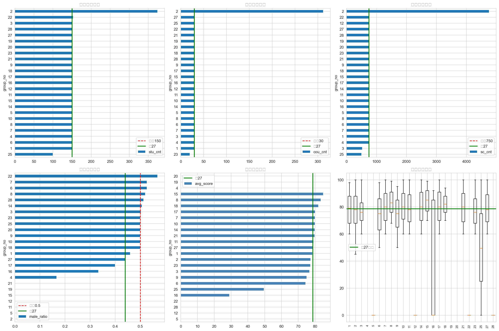
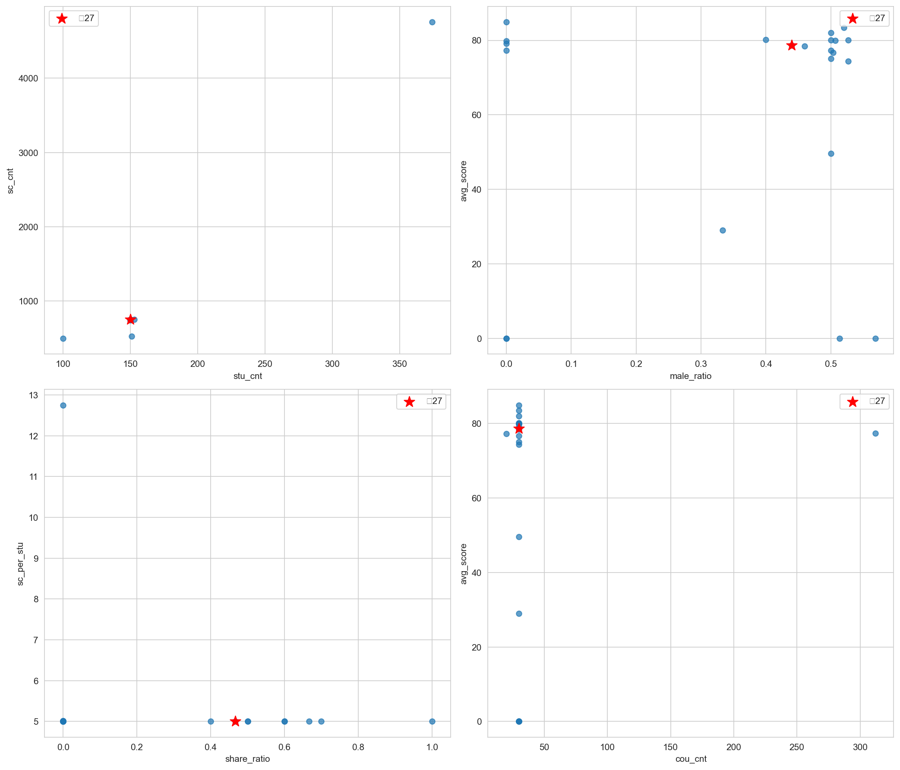
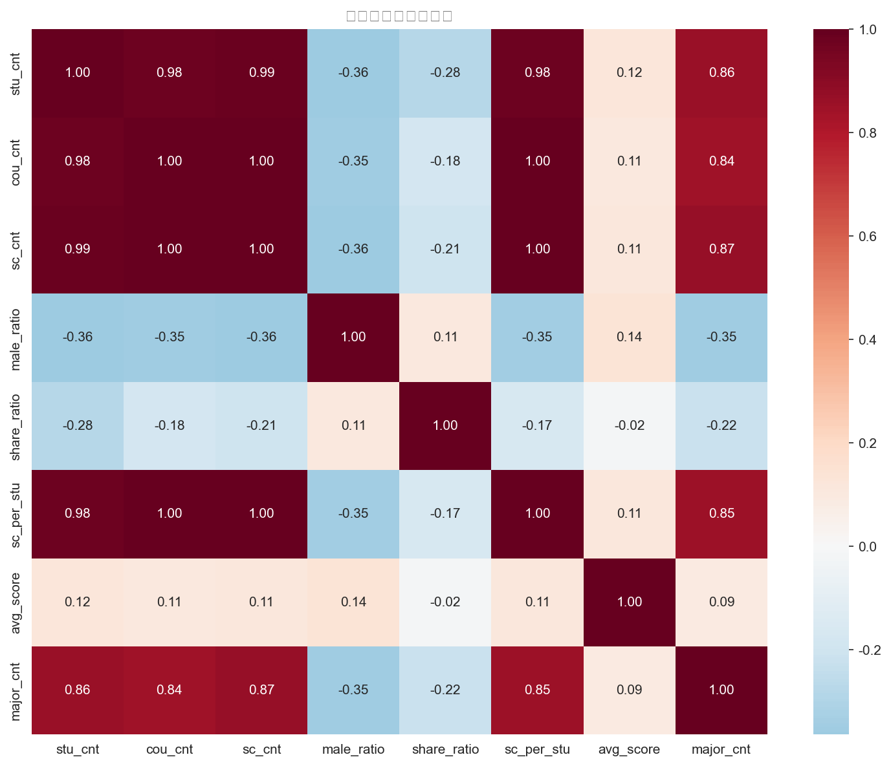
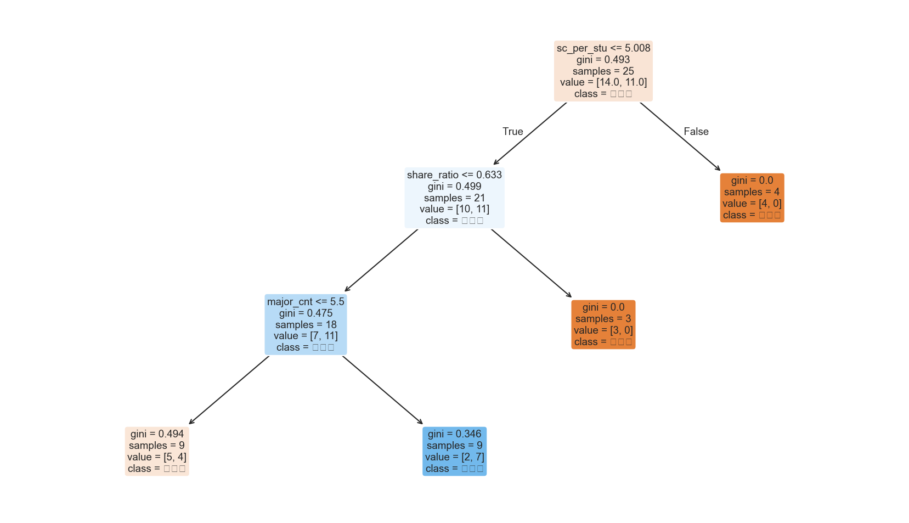

# 作业四：各组作业三数据探索与分析报告

**组号**: 27  
**数据来源**: 远端 MySQL (10.60.254.44:3306/hw4) → student.csv / course.csv / sc.csv  
**分析工具**: Python (pandas, scikit-learn, xgboost, matplotlib, seaborn)
**小组成员：**

- 231250108 李孝胤
- 231250125 沈红旗
- 231250033 戴志洋
- 231250016 孙子然
- 231250075 郭炳辰
- 231250110 尚昊毅

---

## 一、数据概览

| 表 | 总行数 | 组数 | 本组(27)行数 | 本组院系分布 |
|----|--------|------|-------------|-------------|
| student | 3,929 | 26 | 150 | A:50, B:50, C:50 |
| course | 1,022 | 25 | 30 | A:10, B:10, C:10 |
| sc | 22,287 | 25 | 751 | A:250, B:250, C:251 |

各组基本统计量：

| 指标 | 均值 | 标准差 | 最小值 | 中位数 | 最大值 |
|------|------|--------|--------|--------|--------|
| 学生数 | 157.1 | 46.3 | 100 | 150 | 374 |
| 课程数 | 40.9 | 56.5 | 10 | 30 | 300+ |
| 选课数 | 891.5 | 807.6 | 250 | 750 | 4800+ |
| 男生比例 | 0.34 | 0.23 | 0.00 | 0.50 | 0.57 |
| 人均选课 | 5.31 | 1.55 | 5.00 | 5.00 | 12.75 |
| 平均成绩 | 61.2 | 32.0 | 0.0 | 77.9 | 84.9 |

---

## 二、本组(27)数据特征

### 整体特征 vs 全量均值

| 指标 | 本组 | 全量均值±标准差 | z-score | 判定 |
|------|------|---------------|---------|------|
| 学生数 | 150 | 157.1±46.3 | -0.15 | 正常 |
| 男生比例 | 0.44 | 0.34±0.23 | +0.44 | 正常 |
| 专业数 | 9 | 7.5±6.8 | +0.22 | 正常 |
| 课程数 | 30 | 40.9±56.5 | -0.19 | 正常 |
| 共享率 | 0.47 | 0.23±0.31 | +0.75 | 正常 |
| 选课数 | 751 | 891.5±807.6 | -0.17 | 正常 |
| 人均选课 | 5.01 | 5.31±1.55 | -0.20 | 正常 |
| 平均成绩 | 78.66 | 61.18±31.97 | +0.55 | 正常 |

> **结论**: 本组在所有维度上均无异常，数据规范完整。

### 院系级明细

| 院系 | 学生 | 男生比 | 专业数 | 课程 | 共享率 | 选课 | 均分 |
|------|------|--------|--------|------|--------|------|------|
| A | 50 | 50.0% | 8 | 10 | 0% | 250 | 78.7±11.4 |
| B | 50 | 50.0% | 8 | 10 | 70% | 250 | 78.8±11.2 |
| C | 50 | 32.0% | 4 | 10 | 70% | 251 | 78.5±11.8 |

> **发现**: 院系C男生仅32%，低于A/B的50%；院系C仅4专业，少于A/B的8专业。三院系成绩分布高度一致（均分78.5~78.8）。

---

## 三、异常检测

### 方法

对各组特征计算 z-score，|z| > 2 判定为异常。

### 异常组清单

| 组号 | 异常指标 | 具体情况 |
|------|---------|---------|
| **2** | 学生数、课程数、人均选课 | 学生374人（2.4σ），课程300+，人均12.75门——疑似多轮重复上传 |
| **5** | 平均成绩 | 成绩 0.0 —— 选课表score字段全为空 |
| **12** | 平均成绩 | 成绩 0.0 —— 同上 |
| **22** | 平均成绩 | 成绩 0.0 —— 同上 |
| **28** | 平均成绩 | 成绩 0.0 —— 同上 |
| **25** | 共享率、院系缺失 | 共享率异常 + student表缺院系 + sc表缺院系 |

### 院系完整性

| 表 | 缺院系的组 |
|----|----------|
| student | 25, 221250099 |
| course | 全部完整 |
| sc | 25 |

---

## 四、可视化图表

### 图1: 各组概览（6维对比）

六张子图分别展示各组的学生数、课程数、选课数、男生比例、平均成绩、成绩分布。红线为标准值，绿线为本组(27)。

**观察**:
- 大多数组数据量在150/30/750左右，符合作业规范
- 组2在所有维度显著偏离
- 本组成绩中上水平（78.7），处于前40%

### 图2: 散点图矩阵

四个关键散点图：学生数-选课数（高度线性相关）、男生比-均分、共享率-人均选课、课程数-均分。

**观察**:
- 学生数与选课数几乎成完美线性关系（r≈1.0），每学生固定5门课
- 本组位于男女生均衡、成绩中上的区域

### 图3: 相关性热力图

各特征间相关性：
- stu_cnt ↔ sc_cnt: 强正相关（0.99），符合每人5门课
- share_ratio ↔ sc_per_stu: 中等正相关，高共享组人均选课更多
- male_ratio ↔ avg_score: 弱相关

### 图4: 决策树可视化

将各组按成绩中位数分为"高分组"/"低分组"，构建决策树分类模型。

---

## 五、组间相似度分析

### 余弦相似度 Top5

| 排名 | 组号 | 相似度 |
|------|------|--------|
| 1 | **7** | **0.9709** |
| 2 | 23 | 0.8894 |
| 3 | 18 | 0.8015 |
| 4 | 3 | 0.6670 |
| 5 | 25 | 0.6099 |

### 欧氏距离 Top5

| 排名 | 组号 | 距离 |
|------|------|------|
| 1 | **7** | **0.5771** |
| 2 | 3 | 0.9999 |
| 3 | 18 | 1.0300 |
| 4 | 23 | 1.2035 |
| 5 | 17 | 1.4981 |

> **结论**: 组7与本组最为相似（余弦0.971，欧氏0.577），两组数据特征高度一致。

### 层次聚类

采用 Ward 链接法，将所有组分为4类：

| 类别 | 组成员 | 特征 |
|------|--------|------|
| 第1类 | 大部分常规组 | 标准数据量，均值附近 |
| **第2类** | **3, 7, 16, 18, 23, 25, 27** | **共享率高，成绩中上** |
| 第3类 | 2 | 数据量异常大 |
| 第4类 | 5, 12, 22, 28 | 成绩为0 |

> **结论**: 本组(27)属于第2类，与组3、7、16、18、23、25具有相似的数据特征，特点是共享课程比例较高、成绩处于中上水平。

---

## 六、分类模型

### 决策树

| 指标 | 值 |
|------|-----|
| 交叉验证准确率 | 48.0% |
| 最大深度 | 3 |

特征重要性：

| 特征 | 重要性 |
|------|--------|
| share_ratio（共享率） | 0.4031 |
| sc_per_stu（人均选课） | 0.3870 |
| major_cnt（专业数） | 0.2099 |
| stu_cnt / male_ratio / cou_cnt | 0.0000 |

### XGBoost

| 指标 | 值 |
|------|-----|
| 交叉验证准确率 | 40.0% |
| n_estimators | 100 |

特征重要性：

| 特征 | 重要性 |
|------|--------|
| sc_per_stu（人均选课） | 0.4582 |
| major_cnt（专业数） | 0.3466 |
| male_ratio（男生比例） | 0.1032 |
| share_ratio（共享率） | 0.0920 |

> **说明**: 准确率偏低是因为仅有25个样本（25组），机器学习模型需要更多数据才能有效。但特征重要性分析仍然有价值——**人均选课数**和**专业数**是区分组间差异的最关键特征。

---

## 七、结论与建议

### 关于本组数据

1. **数据质量优秀**: 150/30/751完全符合作业规范，z-score均小于1，无异常
2. **三院系统一性**: A/B两院男女均衡(~50%)，C院男生偏少(32%)——符合C系统原始生成逻辑
3. **成绩水平**: 均分78.7，处于全量前40%，选课数据生成质量好

### 关于其他组

1. **组2**: 数据量巨大（374学生），疑似包含多轮测试数据或重复上传，建议清理
2. **组5/12/22/28**: score字段全为空或为0，选课表可能未正确填入成绩数据
3. **组25**: 部分院系数据缺失，上传可能不完整
4. **组7**: 与本组数据特征最接近，共享率高且成绩中上

### 方法局限性

- 仅25组样本，分类模型准确率有限
- 未考虑课程名/专业名的文本相似度
- 成绩分布可能存在各组生成策略差异（随机种子、分数范围等）
