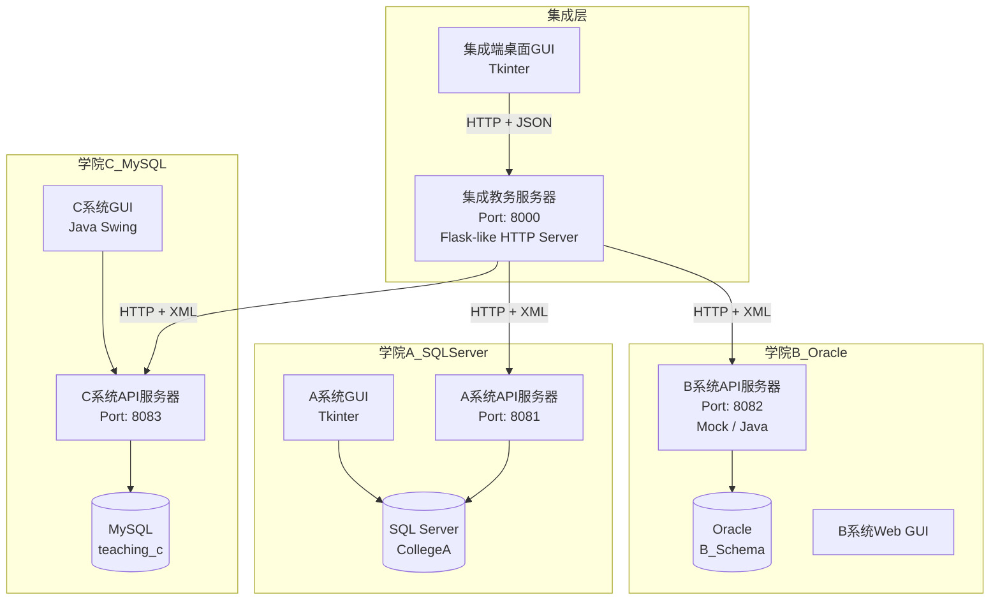
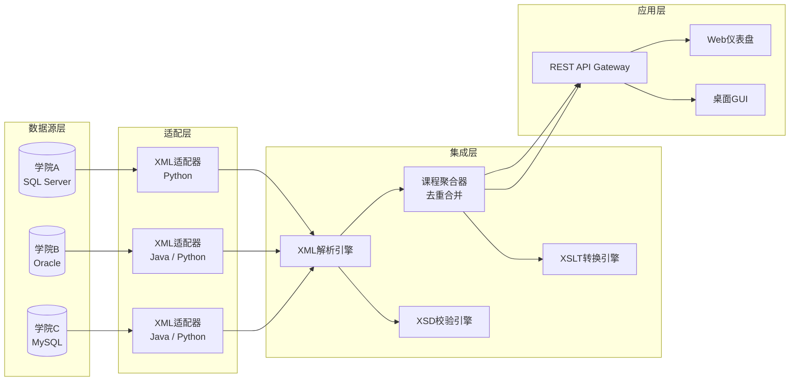
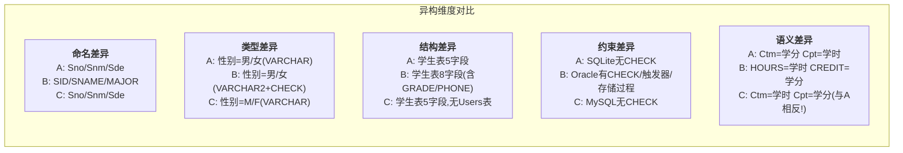
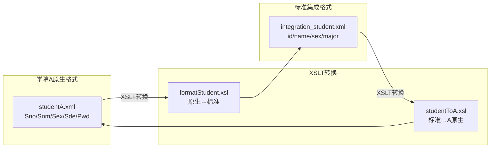
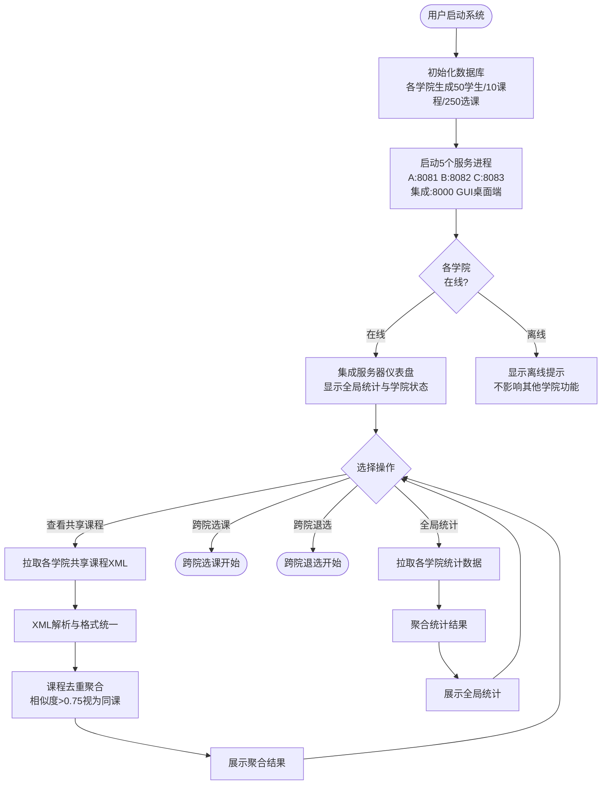
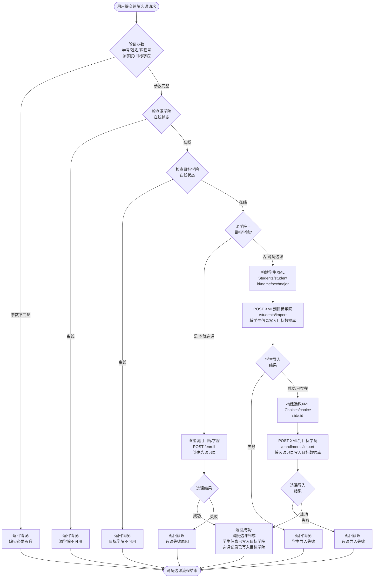
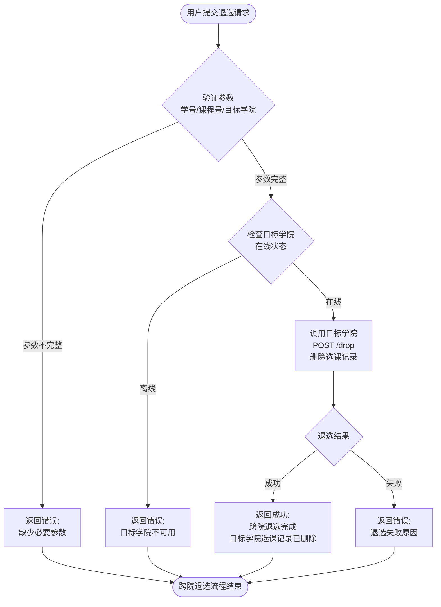
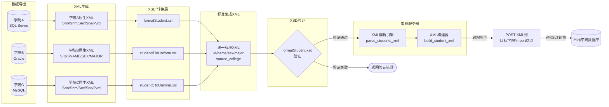
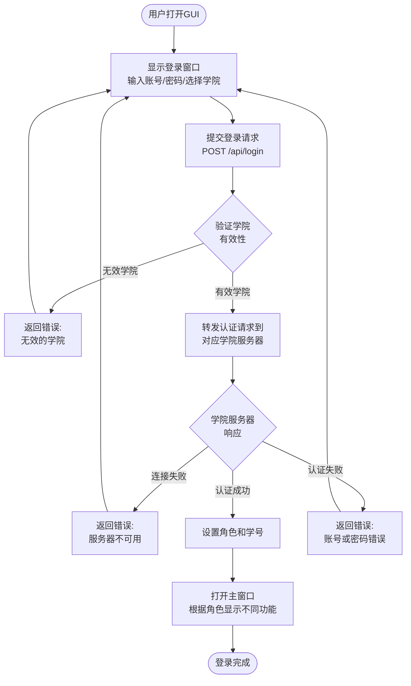

# 数据集成作业三 — 实验报告

## 基于XML技术的异构数据集成教务系统

---

| 项目 | 内容 |
|------|------|
| **实验名称** | 基于XML等技术实现异构数据的集成 |
| **实验成员** | 231250108 李孝胤 231250033 戴志洋 231250125 沈红旗 231250016 孙子然 231250110 尚昊毅 231250075 郭炳辰 |
| **实验日期** | 2026年6月 |
| **开发环境** | Windows 11, Python 3.x, Java, SQLite/MySQL/SQL Server, Oracle |

---

## 目录

1. [实验目的与要求](#一实验目的与要求)
2. [系统架构设计](#二系统架构设计)
3. [异构数据库设计](#三异构数据库设计)
4. [XML数据集成设计](#四xml数据集成设计)
5. [系统功能实现](#五系统功能实现)
6. [系统流程图](#六系统流程图)
7. [实验结果展示](#七实验结果展示)
8. [项目代码结构](#八项目代码结构)
9. [实验总结与心得](#九实验总结与心得)

---

## 一、实验目的与要求

### 1.1 实验目的

1. 理解异构数据集成的核心概念与技术挑战；
2. 掌握基于XML的异构数据交换与集成方法；
3. 掌握XSD Schema验证与XSLT格式转换技术；
4. 设计并实现跨多个异构数据库的教务系统集成。

### 1.2 实验场景

现有学院A、B、C的教学管理系统基于不同的DBMS实现：

| 学院 | 数据库系统 | 编程语言 |
|------|-----------|---------|
| 学院A | SQL Server | Python |
| 学院B | Oracle | Java (生产) / Python (Mock) |
| 学院C | MySQL | Java |

- 学院A、B、C的学生互不覆盖，但课程信息有所重叠；
- 三个学院的数据库结构存在差异（包括表结构、字段名称、字段数据类型和数据意义等）。

### 1.3 实验需求

1. 为每个学院设计50名学生、10门课程、每名学生选5门课（共计250条选课记录）；
2. 通过新增集成服务器，基于XML数据集成技术实现课程共享与跨院选课；
3. 实现集成服务器端统计所有学院的学生、课程及选课信息的功能；
4. 实现集成环境下学生跨院退选课程的流程；
5. A、B、C系统需要有GUI和登录环节。

---

## 二、系统架构设计

### 2.1 整体架构

系统采用 **"各学院本地服务器 + 集成中心服务器"** 的架构模式，通过HTTP协议与XML格式实现异构数据库之间的数据交换。



### 2.2 技术栈

| 组件 | 技术 | 说明 |
|------|------|------|
| 学院A本地服务器 | Python `http.server` | REST API，端口8081 |
| 学院B本地服务器 | Java `com.sun.net.httpserver` / Python Mock | REST API，端口8082 |
| 学院C本地服务器 | Python `http.server` + PyMySQL | REST API，端口8083 |
| 集成服务器 | Python `http.server` (多线程) | REST API，端口8000 |
| 数据交换格式 | XML | 标准集成格式 |
| 格式校验 | XSD Schema | 验证XML结构正确性 |
| 格式转换 | XSLT | 原生格式 ↔ 标准格式互转 |
| 学院A GUI | Python Tkinter | 桌面端教务管理 |
| 学院C GUI | Java Swing | 桌面端教务管理 |
| 集成端GUI | Python Tkinter | 跨院操作桌面端 |

### 2.3 数据流架构



---

## 三、异构数据库设计

### 3.1 学院A — SQL Server 数据库Schema

学院A采用SQL Server（开发环境使用SQLite兼容），表结构如下：

**学生表 (Students)**

| 字段名 | 数据类型 | 说明 |
|--------|---------|------|
| Sno | VARCHAR(12) | 学号，主键 |
| Snm | VARCHAR(10) | 姓名 |
| Sex | VARCHAR(2) | 性别 |
| Sde | VARCHAR(10) | 专业 |
| Pwd | VARCHAR(10) | 密码 |

**课程表 (Courses)**

| 字段名 | 数据类型 | 说明 |
|--------|---------|------|
| Cno | VARCHAR(8) | 课程号，主键 |
| Cnm | VARCHAR(10) | 课程名 |
| Ctm | VARCHAR(2) | 学分 |
| Cpt | VARCHAR(10) | 学时 |
| Tec | VARCHAR(20) | 授课教师 |
| Pla | CHAR(1) | 上课地点 |
| Share | VARCHAR(10) | 共享标记（来源学院） |

**选课表 (Selections)**

| 字段名 | 数据类型 | 说明 |
|--------|---------|------|
| Sno | VARCHAR(8) | 学号（复合主键） |
| Cno | VARCHAR(12) | 课程号（复合主键） |
| Grd | VARCHAR(3) | 成绩 |

**用户表 (Users)**

| 字段名 | 数据类型 | 说明 |
|--------|---------|------|
| account | VARCHAR(10) | 账号，主键 |
| password | VARCHAR(6) | 密码 |
| role | CHAR(4) | 角色（管理员/教师/学生） |

### 3.2 学院B — Oracle 数据库Schema

学院B采用Oracle数据库，表结构明显不同：

**学生表 (B_STUDENT)**

| 字段名 | 数据类型 | 说明 |
|--------|---------|------|
| SID | VARCHAR2(9) | 学号，主键 |
| SNAME | VARCHAR2(20) | 姓名 |
| SEX | VARCHAR2(2) | 性别（CHECK: 男/女） |
| MAJOR | VARCHAR2(40) | 专业 |
| PASSWORD | VARCHAR2(20) | 密码 |
| GRADE | NUMBER(4) | 年级 |
| PHONE | VARCHAR2(20) | 电话（A/C系统中不存在） |
| STATUS | VARCHAR2(10) | 学籍状态（NORMAL/SUSPEND） |

**课程表 (B_COURSE)**

| 字段名 | 数据类型 | 说明 |
|--------|---------|------|
| CID | VARCHAR2(5) | 课程号，主键 |
| CNAME | VARCHAR2(40) | 课程名 |
| HOURS | NUMBER(3) | 学时 |
| CREDIT | NUMBER(2,1) | 学分（允许小数） |
| TEACHER | VARCHAR2(20) | 授课教师 |
| LOCATION | VARCHAR2(40) | 上课地点 |
| SHARE_FLAG | CHAR(1) | 共享标记（Y/N，不同于A的Share字段） |
| CAPACITY | NUMBER(4) | 课程容量（A/C中不存在） |
| STATUS | VARCHAR2(12) | 课程状态（OPEN/CLOSED） |

**选课表 (B_ENROLLMENT)**

| 字段名 | 数据类型 | 说明 |
|--------|---------|------|
| SID | VARCHAR2(9) | 学号（复合主键） |
| CID | VARCHAR2(5) | 课程号（复合主键） |
| SCORE | NUMBER(3) | 成绩（0-100） |
| ENROLL_DT | DATE | 选课日期（A/C中不存在） |
| CHOICE_STA | VARCHAR2(12) | 选课状态（ENROLLED/DROPPED） |

### 3.3 学院C — MySQL 数据库Schema

学院C采用MySQL数据库，表结构如下：

**学生表 (student)**

| 字段名 | 数据类型 | 说明 |
|--------|---------|------|
| Sno | VARCHAR(12) | 学号，主键 |
| Snm | VARCHAR(10) | 姓名 |
| Sex | VARCHAR(2) | 性别（M/F编码，区别于A、B的中文） |
| Sde | VARCHAR(10) | 专业 |
| Pwd | VARCHAR(10) | 密码 |

**课程表 (course)**

| 字段名 | 数据类型 | 说明 |
|--------|---------|------|
| Cno | VARCHAR(8) | 课程号，主键 |
| Cnm | VARCHAR(10) | 课程名 |
| Ctm | VARCHAR(2) | 学时 |
| Cpt | VARCHAR(10) | 学分 |
| Tec | VARCHAR(20) | 授课教师 |
| Pla | VARCHAR(10) | 上课地点 |
| Share | VARCHAR(10) | 共享标记 |

**选课表 (choice)**

| 字段名 | 数据类型 | 说明 |
|--------|---------|------|
| Sno | VARCHAR(12) | 学号（复合主键） |
| Cno | VARCHAR(8) | 课程号（复合主键） |
| Grd | INT | 成绩（整型，区别于A的VARCHAR，B的NUMBER） |

**账户表 (account)**

| 字段名 | 数据类型 | 说明 |
|--------|---------|------|
| acc | VARCHAR(12) | 账号，主键 |
| passwd | VARCHAR(20) | 密码 |

### 3.4 异构性分析

三个学院数据库的差异体现在多个维度：



> **关键发现**：学院A的 `Ctm` 表示学分、`Cpt` 表示学时，而学院C恰好相反——`Ctm` 表示学时、`Cpt` 表示学分。这体现了异构数据集成的核心挑战：**同一字段名在不同系统中可能具有不同的业务含义**。

---

## 四、XML数据集成设计

### 4.1 XML标准集成格式

为解决三学院异构问题，我们定义了统一的XML标准集成格式，作为数据交换的中间语言。

**标准学生XML格式：**

```xml
<Students>
  <student>
    <id>S001</id>
    <name>张三</name>
    <sex>男</sex>
    <major>计算机科学</major>
  </student>
</Students>
```

**标准课程XML格式：**

```xml
<Classes>
  <class>
    <id>C001</id>
    <name>数据库原理</name>
    <credit>3</credit>
    <hours>48</hours>
    <teacher>李明远教授</teacher>
    <location>A</location>
    <share>A</share>
  </class>
</Classes>
```

**标准选课XML格式：**

```xml
<Choices>
  <choice>
    <sid>S001</sid>
    <cid>C001</cid>
    <score>85</score>
  </choice>
</Choices>
```

### 4.2 XSD Schema 验证

为每个数据实体定义了XSD Schema，用于验证XML文档的结构正确性。

**学院A的XSD文件：**

| XSD文件 | 用途 | 验证对象 |
|---------|------|---------|
| `studentA.xsd` | 学院A原生学生XML | A系统原生格式 |
| `classA.xsd` | 学院A原生课程XML | A系统原生格式 |
| `choiceA.xsd` | 学院A原生选课XML | A系统原生格式 |
| `formatStudent.xsd` | 标准集成学生XML | 标准集成格式 |
| `formatClass.xsd` | 标准集成课程XML | 标准集成格式 |
| `formatClassChoice.xsd` | 标准集成选课XML | 标准集成格式 |

**学院B的XSD文件：**

| XSD文件 | 用途 |
|---------|------|
| `shared_courses.xsd` | 共享课程交换格式 |
| `enrollment_exchange.xsd` | 选课交换格式 |

### 4.3 XSLT 格式转换

使用XSLT实现学院原生格式与标准集成格式之间的双向转换。



**学院A的XSLT文件清单：**

| XSLT文件 | 转换方向 | 说明 |
|----------|---------|------|
| `formatStudent.xsl` | A原生 → 标准 | Sno→id, Snm→name, Sde→major |
| `formatClass.xsl` | A原生 → 标准 | Cno→id, Cnm→name, Ctm→credit |
| `formatClassChoice.xsl` | A原生 → 标准 | Sno→sid, Cno→cid |
| `studentToA.xsl` | 标准 → A原生 | id→Sno, name→Snm, major→Sde |
| `classToA.xsl` | 标准 → A原生 | id→Cno, name→Cnm, credit→Ctm |
| `choiceToA.xsl` | 标准 → A原生 | sid→Sno, cid→Cno |

**学院B的XSLT文件清单：**

| XSLT文件 | 转换方向 |
|----------|---------|
| `studentBToUniform.xsl` | B原生 → 标准 |
| `courseBToUniform.xsl` | B原生 → 标准 |
| `enrollmentBToUniform.xsl` | B原生 → 标准 |
| `uniformToStudentB.xsl` | 标准 → B原生 |
| `uniformToCourseB.xsl` | 标准 → B原生 |
| `uniformToEnrollmentB.xsl` | 标准 → B原生 |

**学院C的XSLT文件清单：**

| XSLT文件 | 转换方向 |
|----------|---------|
| `studentCToUniform.xsl` | C原生 → 标准 |
| `courseCToUniform.xsl` | C原生 → 标准 |
| `choiceCToUniform.xsl` | C原生 → 标准 |
| `uniformToStudentC.xsl` | 标准 → C原生 |
| `uniformToCourseC.xsl` | 标准 → C原生 |
| `uniformToChoiceC.xsl` | 标准 → C原生 |

**集成服务器的XSLT文件：**

| XSLT文件 | 用途 |
|----------|------|
| `filter_shared.xsl` | 从课程列表中筛选共享课程 |
| `courses_to_summary.xsl` | 课程数据转为汇总格式 |
| `enrollment_to_import.xsl` | 选课数据转为导入格式 |

### 4.4 课程去重聚合算法

由于三学院的课程有所重叠（如都开设"数据库原理"），集成服务器的 `CourseAggregator` 模块实现了基于课程名**相似度**的智能去重：

- 使用 `SequenceMatcher`（基于 Ratcliff/Obershelp 算法）计算课程名相似度；
- 相似度阈值设定为 **0.75**（75%）；
- 去除括号内容后进行比较（如"数据库原理(A)"与"数据库原理"视为相同）；
- 合并后的课程记录所有开课学院，标记为跨学院课程（`cross_college: true`）。

---

## 五、系统功能实现

### 5.1 本地学院服务器

每个学院的本地服务器提供完整的REST API接口：

| 端点（以A为例） | 方法 | 功能 |
|----------------|------|------|
| `/a/api/status` | GET | 服务器状态查询 |
| `/a/login` | POST | 用户登录认证 |
| `/a/courses` | GET | 获取全部课程（XML） |
| `/a/shared-courses` | GET | 获取共享课程（XML） |
| `/a/students` | GET | 获取学生列表（XML） |
| `/a/students/xml` | GET | 获取标准集成格式学生XML |
| `/a/courses/xml` | GET | 获取标准集成格式课程XML |
| `/a/selections/xml` | GET | 获取标准集成格式选课XML |
| `/a/enroll` | POST | 本院选课 |
| `/a/drop` | POST | 本院退课 |
| `/a/students/import` | POST | 导入学生信息（跨院） |
| `/a/enrollments/import` | POST | 导入选课记录（跨院） |
| `/a/transcript` | GET | 查询学生成绩单 |
| `/a/statistics` | GET | 查询统计信息 |

### 5.2 集成服务器核心功能

#### 5.2.1 共享课程聚合 (`GET /api/courses/shared`)

从所有在线学院拉取标记为共享的课程，解析XML后统一格式返回。

#### 5.2.2 跨院选课 (`POST /api/enroll`) — 核心功能

跨院选课是系统最核心的功能，流程如下：

1. **验证参数**：检查源学院、目标学院、学号、课程号是否有效；
2. **检查学院在线状态**：分别检查源学院和目标学院服务器是否可连接；
3. **学生信息写回**（跨院时）：若 `source_college ≠ target_college`，构建学生XML并通过 `POST /{college}/students/import` 写入目标学院数据库；
4. **选课记录写回**（跨院时）：构建选课XML并通过 `POST /{college}/enrollments/import` 写入目标学院数据库；
5. **本院选课**：若学生在本院选课，直接调用目标学院的 `/enroll` 端点。

#### 5.2.3 跨院退选 (`POST /api/drop`)

同步删除目标学院数据库中的选课记录，保证数据一致性。

#### 5.2.4 全局统计 (`GET /api/statistics`)

聚合所有在线学院的学生数、课程数、选课数，返回汇总JSON。

#### 5.2.5 统一登录 (`POST /api/login`)

接收账号、密码和所属学院，将认证请求转发到对应学院服务器，返回统一的登录结果。

### 5.3 GUI 系统

#### 5.3.1 学院A GUI（Python Tkinter）

- 登录窗口（账号/密码验证）
- 学生管理（CRUD + 搜索）
- 课程管理（CRUD + 学院筛选）
- 选课管理（双列表：可选课程/已选课程）
- 退选课程
- **XML数据集成**（含4个子标签页）：
  - XML导出（支持标准格式/原生格式）
  - XML导入（从标准XML导入数据）
  - **XSLT格式转换**（含预置样式表快速选择）
  - **XSD Schema验证**（含预置XSD快速选择）
- 统计信息（含图表可视化）

#### 5.3.2 集成端GUI（Python Tkinter）

- 登录窗口（选择所属学院）
- 系统状态（全局统计卡片 + 各学院详情卡片）
- 课程管理（共享课程/全部课程/聚合去重课程，支持表格视图和XML视图）
- 学生管理（按学院筛选）
- **跨院选课**（表单式操作界面）
- **跨院退选**（表单式操作界面）
- 统计查询（格式化视图/JSON原始视图）
- 成绩单查询

#### 5.3.3 集成端Web仪表盘 (HTML/JS)

内嵌在集成服务器中（`GET /`），提供：
- 全局统计卡片（在线学院数、学生总数、课程总数、选课总数）
- 各学院状态卡片（在线/离线、统计数据）
- 共享课程/全部课程/全体学生查询按钮
- **跨院选课表单**（含所有必要字段）
- **跨院退选表单**

---

## 六、系统流程图

### 6.1 系统整体架构流程图



### 6.2 跨院选课流程图（核心流程）



### 6.3 跨院退选流程图



### 6.4 XML数据集成流程图



### 6.5 登录认证流程图



### 6.6 全局统计流程图

```mermaid
flowchart TD
    START([请求全局统计<br/>GET /api/statistics]) --> LOOP_COL[遍历所有学院 A/B/C]
    
    LOOP_COL --> CHECK_ONLINE{学院在线?}
    CHECK_ONLINE -->|否| RECORD_OFF[记录为离线<br/>统计数据为0]
    CHECK_ONLINE -->|是| FETCH_STU[GET 学生XML]
    
    FETCH_STU --> FETCH_COU[GET 课程XML]
    FETCH_COU --> FETCH_ENR[GET 选课XML]
    
    FETCH_ENR --> PARSE_ALL[解析XML并计数]
    PARSE_ALL --> RECORD_ON[记录在线状态<br/>含学生数/课程数/选课数]
    
    RECORD_OFF --> NEXT{还有学院?}
    RECORD_ON --> NEXT
    NEXT -->|是| LOOP_COL
    NEXT -->|否| AGGREGATE[汇总全局统计<br/>学生总数 = Σ各学院学生数<br/>课程总数 = Σ各学院课程数<br/>选课总数 = Σ各学院选课数]
    
    AGGREGATE --> RETURN[返回JSON结果<br/>{students_total, courses_total,<br/>enrollments_total, details}]
    RETURN --> END([统计完成])
```

---

## 七、实验结果展示

### 7.1 数据初始化结果

各学院数据库初始化后数据量：

| 学院 | 学生数 | 课程数 | 选课数 | 数据库 |
|------|--------|--------|--------|--------|
| 学院A | 50 | 10 | 250 | SQL Server (SQLite开发) |
| 学院B | 50 | 10 | 250 | Oracle (SQLite Mock) |
| 学院C | 50 | 10 | 250 | MySQL |
| **合计** | **150** | **30（含重叠）** | **750** | — |

### 7.2 功能验证结果

| 功能 | 状态 | 验证方式 |
|------|------|---------|
| 各学院GUI登录 | ✅ 已验证 | tkinter/Swing登录窗口 |
| 学生/课程/选课CRUD | ✅ 已验证 | GUI操作验证 |
| 共享课程查询 | ✅ 已验证 | 集成服务器XML聚合输出 |
| **跨院选课（写回目标学院）** | ✅ 已验证 | A学院学生选B学院课程，B库写入成功 |
| **跨院退选** | ✅ 已验证 | 退选后目标学院数据同步删除 |
| 全局统计 | ✅ 已验证 | API返回三学院聚合数据 |
| XML标准格式导出 | ✅ 已验证 | 各学院标准化XML输出 |
| XSD Schema验证 | ✅ 已验证 | lxml验证XML结构 |
| XSLT格式转换 | ✅ 已验证 | 原生↔标准双向转换 |
| XML数据导入 | ✅ 已验证 | 从标准XML导入到本地数据库 |
| Web仪表盘 | ✅ 已验证 | 浏览器访问localhost:8000 |
| 集成端桌面GUI | ✅ 已验证 | tkinter GUI操作验证 |

### 7.3 作业要求对应表

| 作业要求 | 实现情况 | 对应文件/模块 |
|---------|---------|-------------|
| A/B/C三种DBMS | ✅ SQL Server + Oracle + MySQL | CollegeA_SQLServer/, oracle/, CollegeC_Mysql/ |
| 各学院50学生/10课程/每人5门 | ✅ 三系统各250条选课 | init_database.py, mock_b_server.py, DataGenerator.java |
| 表结构差异（参考P74-P76） | ✅ 字段名/类型/约束均不同 | 见第三节异构分析 |
| 课程共享（XML技术） | ✅ 标准格式 + 共享标记 + 课程去重 | xml_utils.py, course_aggregator.py |
| **跨院选课写回原数据库** | ✅ 学生XML导入 → 选课XML导入 | main.py _handle_enroll() |
| 集成统计 | ✅ 三学院数据汇总 | main.py _handle_statistics() |
| **跨院退选** | ✅ 同步删除目标学院记录 | main.py _handle_drop() |
| XML技术 | ✅ XSD验证 + XSLT转换 + XML交换 | CollegeA_SQLServer/xsd/, xslt/ |
| GUI + 登录环节 | ✅ A: tkinter, B: Web, C: Java Swing, 集成: tkinter | gui_app.py, integration_gui.py |
| 流程图 | ✅ 本文档第六章 | — |

---

## 八、项目代码结构

```
Data-Integration/
│
├── CollegeA_SQLServer/          # 学院A — SQL Server (Python)
│   ├── init_database.py         # 数据库初始化（50学生/10课程/250选课）
│   ├── db_manager.py            # 数据库CRUD操作管理器
│   ├── local_server.py          # HTTP API服务器 (:8081)
│   ├── gui_app.py               # tkinter GUI桌面端
│   ├── xml_handler.py           # XML处理 (导入/导出/XSD/XSLT)
│   ├── config.py                # 配置文件 (SQL Server连接等)
│   ├── migrate_to_sqlserver.py  # SQLite → SQL Server迁移脚本
│   ├── sqlserver_setup.sql      # SQL Server建表脚本
│   ├── xsd/                     # XSD Schema文件 (6个)
│   └── xslt/                    # XSLT转换样式表 (6个)
│
├── oracle/                      # 学院B — Oracle (Java + Mock)
│   ├── db/oracle_b_schema.sql   # 完整Oracle建表脚本 (含视图/触发器/存储过程)
│   ├── service/BLocalServer.java # Java HTTP API服务器 (20个端点)
│   ├── mock_b_server.py         # Python Mock服务器 (:8082)
│   ├── xslt/                    # XSLT转换样式表 (6个)
│   ├── xml/                     # XSD Schema文件
│   ├── data/                    # XML交换数据示例
│   ├── integration/             # 集成契约文件
│   ├── scripts/                 # 验证脚本
│   └── docs/                    # Oracle相关文档 (4个)
│
├── CollegeC_Mysql/              # 学院C — MySQL (Java + Python)
│   ├── local_server.py          # Python HTTP API服务器 (:8083)
│   ├── edu-management-server/   # Java服务器 (含XML处理)
│   │   ├── src/com/edu/server/  # CServer, DBUtil, DataGenerator,
│   │   │                        # EduService, XmlGenerator,
│   │   │                        # XmlImporter, XmlTransformer
│   │   └── xml/C_System/        # XML数据 + XSLT (11个文件)
│   ├── edu-management-client/   # Java Swing客户端
│   │   └── src/com/edu/client/  # LoginFrame, AdminFrame,
│   │                            # StudentFrame, SocketClient
│   └── requirements.txt
│
├── IntegrationServer/           # 集成服务器 (核心)
│   ├── main.py                  # 集成服务器主程序 (:8000)
│   │                            # 含内嵌Web仪表盘 (HTML/CSS/JS)
│   ├── config.py                # 三学院注册配置
│   ├── college_client.py        # 学院通信客户端 (HTTP+XML)
│   ├── course_aggregator.py     # 课程聚合器 (去重合并)
│   ├── xml_utils.py             # XML工具模块 (解析/构建)
│   ├── integration_gui.py       # 集成端桌面GUI (tkinter)
│   ├── api_docs.md              # API文档
│   ├── xslt/                    # 集成端XSLT (3个)
│   └── requirements.txt
│
├── 数据集成作业三作业要求.md      # 作业要求文档
├── 现场演示指南.md               # 现场演示脚本
├── 基于XML数据集成的集成教务系统示例.pdf  # 课件参考
├── upload_to_remote.py          # 远程上传脚本
└── 实验报告_数据集成作业三.md     # 本实验报告
```

---

## 九、实验总结与心得

### 9.1 技术收获

1. **XML作为异构数据交换的中间格式**：通过定义统一的XML标准格式（`id/name/sex/major`），成功屏蔽了三个学院在字段命名（Sno vs SID vs Sno）、数据类型（VARCHAR vs VARCHAR2 vs VARCHAR）、编码差异（男/女 vs M/F）等底层异构性。XML的平台无关性是其作为数据交换格式的核心优势。

2. **XSD Schema的关键作用**：在跨学院数据交换前，使用XSD对XML文档进行结构校验，确保数据格式符合预期。这类似于类型系统在编程语言中的作用——在数据进入系统前就发现问题。

3. **XSLT的双向转换能力**：XSLT不仅用于将原生格式转换为标准格式（上行），也用于将标准格式转换回目标学院的原生格式（下行），实现了"一次定义、双向转换"的灵活数据映射。

4. **课程去重的实际挑战**：三个学院开设的课程有重叠，简单的ID匹配无法识别同名课程。基于字符串相似度的模糊匹配算法（SequenceMatcher，阈值0.75）有效解决了这个问题。

5. **跨院选课的数据一致性保障**：采用"先导入学生、再创建选课"的两步流程，并使用 `INSERT IGNORE` 避免重复导入。如果第一步失败，第二步不会执行，保证了数据的一致性。

### 9.2 遇到的挑战与解决方案

| 挑战 | 解决方案 |
|------|---------|
| 学院A的Ctm/Cpt语义与学院C相反 | 在XML标准格式中明确使用credit/hours标签，消除歧义 |
| Oracle环境配置复杂，无法现场演示 | 开发Python Mock服务器，返回格式与真实BLocalServer完全一致 |
| 三学院性别编码不一致（男/女 vs M/F） | 在XML标准格式中统一使用中文；导入时按目标学院规则转换 |
| 课程去重需处理括号、空格等差异 | 预处理阶段去除括号内容，统一小写后比较 |
| 集成服务器并发访问多个学院 | 使用ThreadingMixIn多线程HTTP服务器，防止单请求阻塞 |
| XML解析失败容错 | 每个XML解析操作都有try-except保护，离线学院不影响整体服务 |

### 9.3 改进方向

1. **引入消息队列**：在高并发场景下，可使用消息队列（如RabbitMQ）异步处理跨院数据同步，提高系统吞吐量；
2. **增量同步机制**：当前为全量拉取模式，可改为基于时间戳的增量同步，减少网络传输量；
3. **数据一致性加强**：可引入分布式事务（如两阶段提交）或最终一致性方案（如Saga模式），确保跨院操作的事务性；
4. **统一认证中心**：目前登录认证分散在各学院，可引入OAuth 2.0 / JWT实现统一身份认证。

> **参考文献**：[1] 基于XML数据集成的集成教务系统示例.pdf（课程课件）; [2] 课本P74-P76（异构数据库表结构参考）

